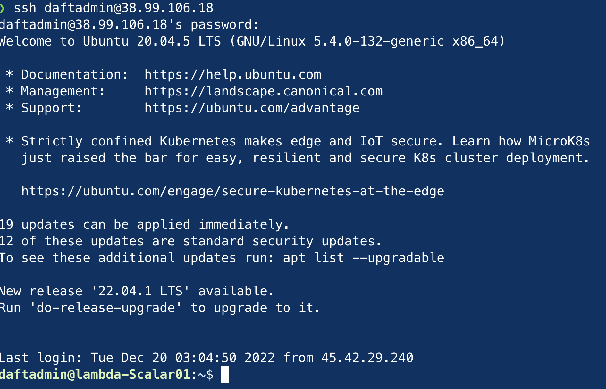
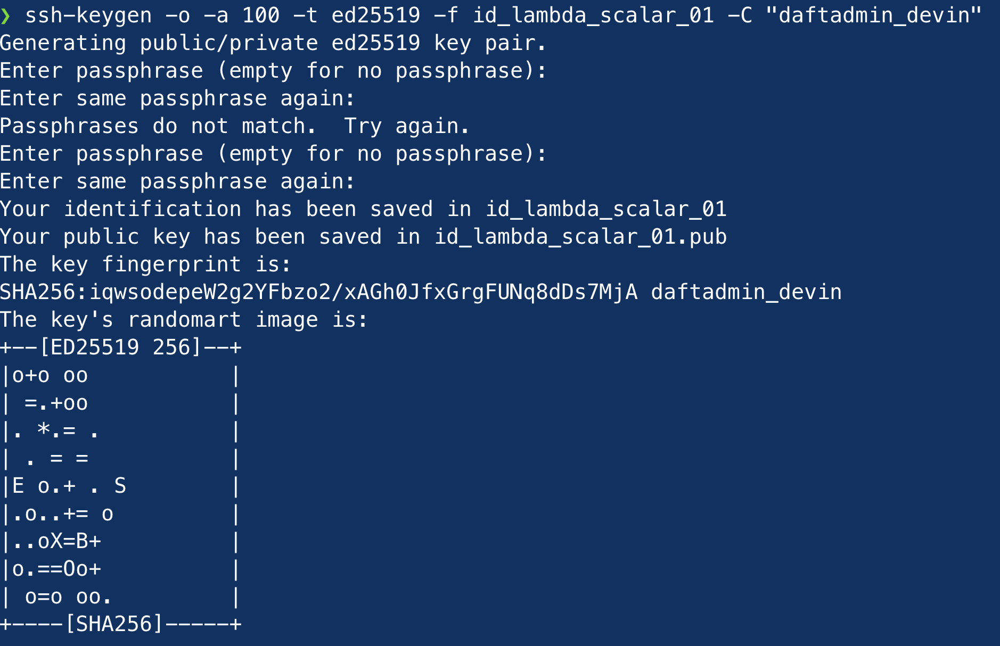

# New Server Setup (logins & ssh keys)

> References: 
> - https://serversforhackers.com/c/logging-into-your-server
> - https://blog.g3rt.nl/upgrade-your-ssh-keys.html

Login with your intial credentials:

`$ ssh <username>@<ip address>`

```
ssh root@123.456.198.01
```
You should be prompted for a password. As you enter it, nothing will populate.
Enter your password and hit 'enter'

```
root@123.456.198.01's password:
```


You will be logged in, and your terminal prompt should have the syntax:

`<user-name>@<server-name>:`

## How to change your password

To change your password, enter: `passwd`


## Authentication errors

Run command:

`ssh -o "PubkeyAuthentication=no" <username>@<ip-address>`

This will skip attempting to authenticate with an SSH key, and prompt you for your password.

## Using SSH keys

Whether you're a software developer or a sysadmin, it's best practice to do this over SSH with public key authentication rather than passwords.

It's also more convenient (not having to use a password all the time).


### List your current keys

Start by taking inventory of your current keys.

On a LOCAL terminal, run:

```
$ for keyfile in ~/.ssh/id_*; do ssh-keygen -l -f "${keyfile}"; done | uniq
```

Example result:


Look for:

> DSA or RSA 1024 bits: red flag. Unsafe.
> RSA 2048: yellow recommended to change
> RSA 3072/4096: great, but Ed25519 has some benefits!
> ECDSA: depends. Recommended to change
> Ed25519: wow cool, but are you brute-force safe?

#### RSA keys

Most common is the RSA type of key, also known as `ssh-rsa` with SSH. 

It's very compatible, but also slow and potentially insecure if created with a small amount of bits (< 2048).

#### Ed25519 keys

Ed25519 keys faster & safer than RSA keys. They are also shorter.

The public key is just about 68 characters.

Generating an Ed25519 key is done using the `-t ed25519` option to the ssh-keygen command.

## Setup SSH Keys

### Step 1: Generate an Ed25519 ssh key pair:

On your local machine:

```
$ cd ~/.ssh
$ ssh-keygen -o -a 100 -t ed25519 -f id_<name-your-file> -C "your-comment"
```

* the `-o` flag uses the "RFC4716 key format".
* the `-a <num>` flag defines the number of "key derivation function rounds", based on whatever number you supply to `<num>`.
* the `-t` flag defines the type of key.
* the `-f` flag allows you to label your filename, making it easy to identify later.
* the `-C` flag allows you to add a comment at the end of the public key, making it easy to identify who the key belongs to.

### Step 2: Set Secure password (optional):

Set a secure password. 

This pw is used when trying to access your private SSH key - and in a later step when we add this private key to your list of keys to be checked by the server to login via SSH.

```
Generating public/private ed25519 key pair.
Enter passphrase (empty for no passphrase): <enter your passphrase here>
Enter same passphrase again: <enter your passphrase here>
```



### Step 3: Add the **SSH Public Key** to the server

1. Display + copy your public key:
2. 
```
$ cat <your_public_key_name> | pbcopy
```

You will see your key:


If you used `| pbcopy` then it will already be copied to your clipboard. 
If not, then just highlight/select it to copy it.


2. Login to your server -> .ssh directory & `ll` to view contents of directory

On your server:
```
$ cd ~/.ssh && ll
```

3. Create an 'authorized_keys' file (if doesn't exist), then add your public key to the file.

```bash
$ touch authorized_keys # create authorized_keys file
$ nano authorized_keys # add your public key to the authorized_keys file
```

**VIM Commands Reminder:**
* `cmd+shift+v` to paste in VIM
* `:wq!` + `enter` to save & exit VIM

### Step 4: Authenticate your **SSH Private Key** to be used by the server when logging in:

Authenticate your SSH Private Keys to be checked by running `ssh-add` & entering that password (from earlier).

On your local machine:

```bash
$ ssh-add ~/.ssh/<your-private-key-filename> # enter your password when prompted
```


### Step 4: Setup the hostfile for password-less logins

1. On your local machine .... Create a `config` (text) file inside your `~/.ssh/` directory (if it doesn't already exit)

Add the following information to the file & replace the information `<inside-these>`:

```
Host *
 #  UseKeychain yes

Host <choose-a-hostname-alias>
    HostName <server-IP-here>
    User <username-here>
    IdentityFile ~/.ssh/<private-key-filename-here>
    IdentitiesOnly yes

```

Save the file & now you can login without typing in a password!

Simply type `ssh username` and you should be good!