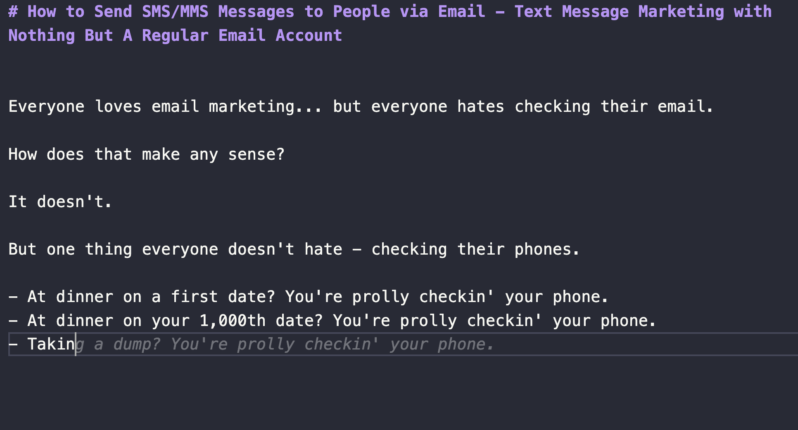
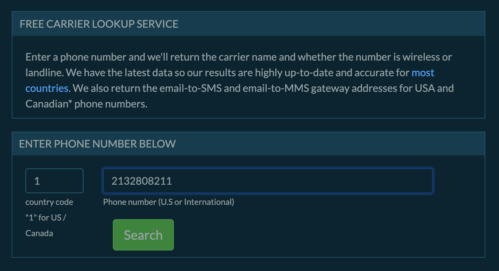
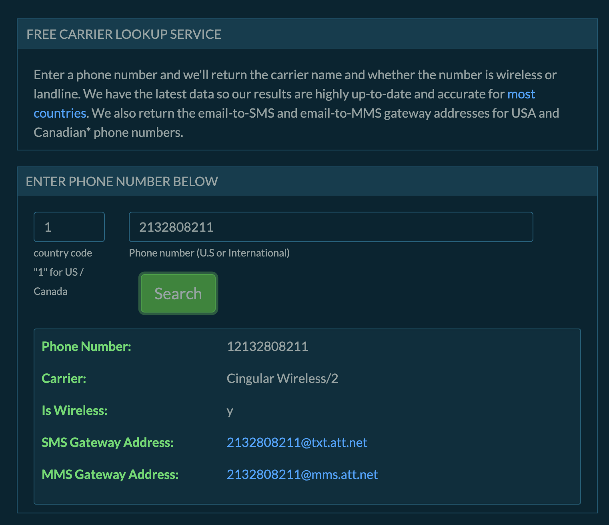
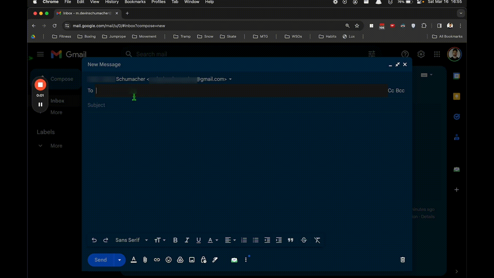

# How to Send SMS/MMS Messages to People via Email - Text Message Marketing with Nothing But A Regular Email Account

Everyone loves email marketing... but everyone hates checking their email. 

How does that make any sense?

It doesn't. 

But one thing everyone doesn't hate - checking their phones.

- At dinner on a first date? You're prolly checkin' your phone.
- At dinner on your 1,000th date? You're prolly checkin' your phone.
- Taking a 💩? You're prolly checkin' your phone.

Honestly, I was about to write that anyways but the face the co-pilot filled it in for me just really sealed that deal.

Anyways, all good marketers know the best time to reach someone is when they're on the toilet - because they got nowhere to go. 

But how do you reach them?

SMS Marketing. Slide into their DMs with a text message.

But with so many SMS marketing platforms out there, how do you know which one to choose?

Easy. You choose none. Because you don't need one.

And in this post, I'm going to show you how to send SMS/MMS messages to people without any SMS software - all you need is that thing everyone hates: an email.

## Why SMS Marketing?

Let's look at some quick stats so you can see why SMS marketing is so powerful:

- SMS marketing has a 98% average open rate (which is 5x that of email marketing ~ 20%)
- SMS marketing also has a 9.18% click-through rate compared to email’s 2.5%.

But email marketing automation tools are super advanced - so if you wanna combine both worlds you can - all you need is an email address... Plus, it's free.

Because look at how ridiculous these prices are for some of the SMS marketing softwares?

Ain't nobody got time for that.

Let's see how it works. (Skip to "How to send SMS/MMS messages to people via email" if you're not interested in the technical stuff)

## SMS/MMS Gateways

An SMS/MMS gateway is a platform that facilitates the sending and receiving of SMS (Short Message Service) and MMS (Multimedia Messaging Service) messages between mobile networks and other media, including email and web applications. 

SMS/MMS gateways often operate on a server or a network of servers that handle the translation and routing of messages between different formats and protocols, ensuring that an SMS or MMS sent from one device can be received and understood by another, even if they're on different networks or using different technologies.

### How Do SMS/MMS Gateways Work?

SMS/MMS gateways work by translating messages from one format or protocol to another, ensuring that they can be sent and received across different networks and devices. 

When a message is sent from one device, it is first translated into a format that can be understood by the recipient's device or network, and then routed to the appropriate destination.

They act like a bridge for the seamless transmission of text and multimedia messages across different devices, carriers, platforms & applications.

## How to send SMS/MMS messages to people via email

You only need 3 things to send SMS/MMS messages to people via email:

1. The recipient's phone number
2. The recipient's carrier/provider
3. An email address

Let's walk through it.

### Step 1: Get their phone number

For this example, we'll use this phone number: `(213) 280-8211`

Cool you have a phone number. You're 30% done already.

### Step 2: Get their carrier/provider & corresponding SMS/MMS gateway

Use a service [like this](https://serp.ly/freecarrierlookup) to lookup the carrier/provider of the phone number.

Plop the phone number in the box:

And hit enter:

You'll see the carrier/provider of the phone number:

- Carrier: Cingular Wireless
- SMS Gateway Address: `2132808211@txt.att.net`
- MMS Gateway Address: `2132808211@mms.att.net`

### Step 3: Email -> SMS/MMS

Now, all you gotta do is send an email to one of those gateway addresses above:

- Use the SMS gateway address if you are sending text.
- Use the MMS gateway address if you are sending multimedia.

Let's try multimedia.

Open your email and send this person a GIF of a dog taking a 💩

If you don't have one bookmarked already, you can use this one:

But since I don't think ill get a reply by the time im dont writing this and I wanna show you how it works, i'll just send myself something instead.

> Note: Notice how the address is literally just the phone number + an @something on the end of it? So, once you have the carrier/provider of the phone number, you're basically just using their phone number to message them - and the Gateway handles the translation.

Let's see it in action:

And that's it. 

You just sent an MMS message to someone via email!

## Hiccups

There are a few things that can go wrong in the beginning, mostly dealing with YOUR provider not accepting responses.

For example, I have ATT and I wasn't able to receive replies, but you just have to speak with your provider and they'll disable that setting for you.

